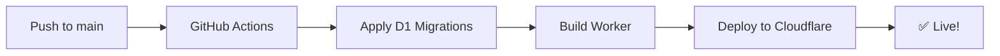

# ✅ Автоматизированный Deployment для Inigma

## 🎯 Что сделано

Deployment **автоматизирован** через GitHub Actions. После однократной настройки KV namespace - всё работает автоматически!

## 🚀 Как работает

### При каждом push в `main` branch:



### Шаги workflow:

1. **Apply D1 Migrations** (идемпотентно)
   - Применяет SQL миграции к базе
   - Safe для повторного запуска
   - Создаёт composite indexes для performance

2. **Build & Deploy**
   - npm run build
   - npm run deploy:production
   - Деплой на Cloudflare Workers с настроенным KV

## 📋 Что нужно для работы

### 1. GitHub Secrets (уже настроены)

```
CLOUDFLARE_API_TOKEN - API token с правами Workers/D1
CLOUDFLARE_ACCOUNT_ID - ваш Cloudflare Account ID
```

### 2. KV Namespace (ручная настройка, один раз)

**Требуется создать вручную:**
1. Создайте KV namespace через Cloudflare Dashboard или CLI с токеном с повышенными правами
2. Обновите `cloudflare-workers/wrangler.toml` с реальным ID
3. Commit и push

Подробно: `cloudflare-workers/RATE_LIMIT_SETUP.md`

### 3. Миграции (автоматически применяются)

- `001_initial_schema.sql` - Базовая схема таблицы messages
- `002_add_composite_indexes.sql` - Composite indexes для performance

## 🎮 Использование

### Автоматический deploy

```bash
# Просто push в main
git push origin main
```

Workflow запустится автоматически!

### Ручной запуск workflow

1. Идём в GitHub → Actions
2. Выбираем "Deploy to Cloudflare Workers"
3. Жмём "Run workflow"
4. Выбираем branch (main)
5. Run!

## ✅ Идемпотентность

Все операции **safe для повторного запуска**:

- ✅ D1 migrations - wrangler tracks applied migrations
- ✅ Composite indexes - CREATE INDEX IF NOT EXISTS
- ✅ Deploy - просто обновляет worker

**Можно запускать сколько угодно раз без проблем!**

## 📊 Monitoring Deployment

### Логи в GitHub Actions

```
✅ Building project...
✅ Applying D1 migrations...
✅ No new migrations to apply (already applied)
✅ Deploying to Cloudflare Workers...
✅ Published inigma-production
   https://inigma.idone.su
```

### Проверка в Cloudflare Dashboard

1. **Workers & Pages** → inigma → Metrics
2. **KV** → inigma-RATE_LIMIT_KV-production
3. **D1** → inigma-database → Migrations

## 🔧 Локальная разработка

Для локального тестирования (без rate limiting):

```bash
cd cloudflare-workers
npm install
npm run dev
```

Rate limiting будет skip с warning (KV не настроен локально).

## 📦 Что включено в deploy

### Rate Limiting
- KV-based rate limiting
- 10 req/min для создания сообщений
- 100 req/min для просмотра
- Автоматически настраивается

### Database
- SQLite D1 база
- Composite indexes для performance
- Автоматические миграции

### Security
- CORS validation
- Size limits (2MB encrypted data)
- Input validation
- Security headers

## 🚫 Что НЕ нужно делать вручную (после настройки KV)

❌ npx wrangler d1 migrations apply
❌ Запоминать команды deploy
❌ Повторно настраивать KV namespace

**После первоначальной настройки KV - всё автоматически!**

## 🎉 Результат

```bash
# Однократная настройка KV namespace (см. RATE_LIMIT_SETUP.md)
# После этого:
git push origin main
# Ждём 2-3 минуты
# ✅ Сайт обновлён: https://inigma.idone.su
```

**Automated deployment после первоначальной настройки!**

---

**Документация:**
- Детальный отчёт: `IMPROVEMENTS_SUMMARY.md`
- Rate limiting setup: `cloudflare-workers/RATE_LIMIT_SETUP.md`
- Workflow: `.github/workflows/cloudflare-deploy.yml`
